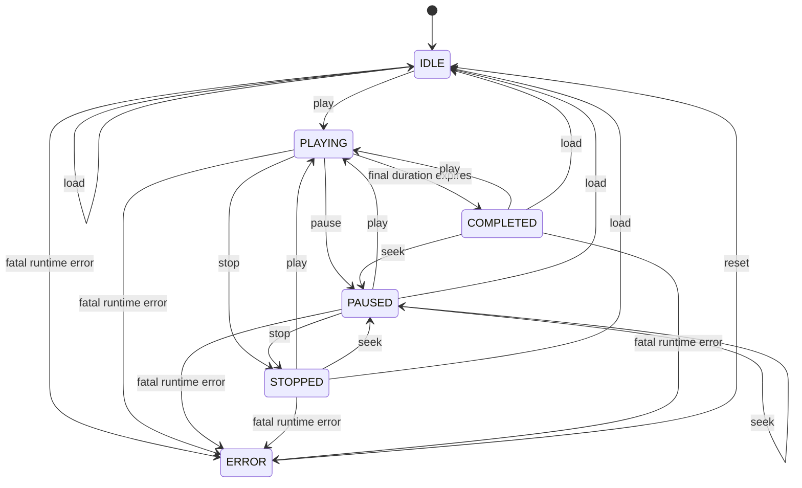

# State Machine: `@rsvp-engine/core`

| State       | Meaning                                                     | Position                          |
| ----------- | ----------------------------------------------------------- | --------------------------------- |
| `IDLE`      | Ready but not presenting.                                   | Selected index `0`, progress `0`. |
| `PLAYING`   | Current item is visible and advancement is scheduled.       | Current visible item.             |
| `PAUSED`    | Current item remains selected; remaining time is preserved. | Unchanged.                        |
| `STOPPED`   | Playback cancelled and reset.                               | Index `0`, progress `0`.          |
| `COMPLETED` | Final item finished its display duration.                   | `length - 1`, progress `1`.       |
| `ERROR`     | Unexpected runtime failure made playback unsafe.            | Preserved until reset.            |

## Error policy

The low-level `StateMachine.transition()` throws `InvalidTransitionError` for an illegal action. `RSVPEngine` catches invalid user controls, emits an `error` event, and preserves its state. Empty data, out-of-range seek, duplicate play, or pause in IDLE are non-fatal.

Unexpected tokenizer or scheduler failures are fatal. Explicit `load()` failures are rethrown after entering `ERROR`; constructor tokenization failures are thrown because no listener can exist yet.

## Invariants

1. Leaving `PLAYING` cancels the pending task.
2. Pause/resume preserves the remaining display time.
3. Seek is unavailable during playback and selects an item in `PAUSED`.
4. Loading replacement data is unavailable in `PLAYING` and `ERROR`.
5. Only `reset()` exits `ERROR`, clearing loaded data and returning to `IDLE`.
