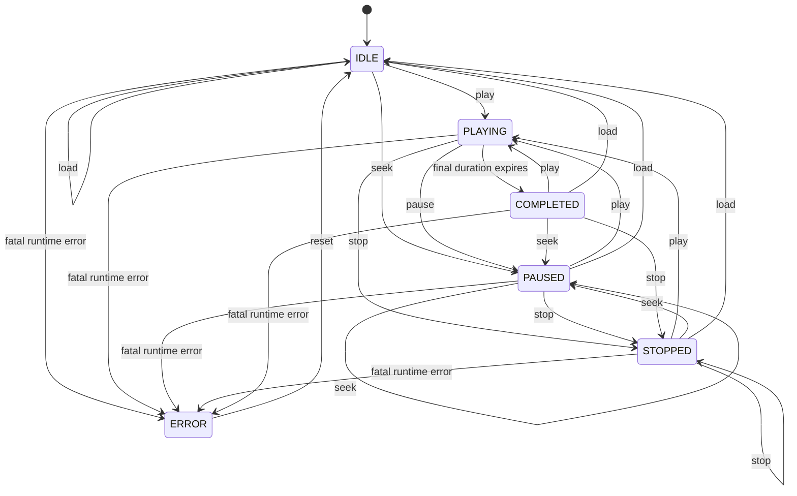

# State Machine: `@rsvp-engine/core`

```mermaid
stateDiagram-v2
    [*] --> IDLE
    IDLE --> PLAYING: play
    IDLE --> IDLE: stop
    IDLE --> PAUSED: seek
    PLAYING --> PAUSED: pause
    PLAYING --> STOPPED: stop
    PLAYING --> COMPLETED: final duration expires
    PAUSED --> PLAYING: play
    PAUSED --> STOPPED: stop
    PAUSED --> PAUSED: seek
    STOPPED --> PLAYING: play
    STOPPED --> STOPPED: stop
    STOPPED --> PAUSED: seek
    COMPLETED --> PLAYING: play
    COMPLETED --> STOPPED: stop
    COMPLETED --> PAUSED: seek
    PAUSED --> IDLE: load
    STOPPED --> IDLE: load
    COMPLETED --> IDLE: load
    IDLE --> IDLE: load
    IDLE --> ERROR: fatal runtime error
    PLAYING --> ERROR: fatal runtime error
    PAUSED --> ERROR: fatal runtime error
    STOPPED --> ERROR: fatal runtime error
    COMPLETED --> ERROR: fatal runtime error
    ERROR --> IDLE: reset
```

| State       | Meaning                                                     | Position                          |
| ----------- | ----------------------------------------------------------- | --------------------------------- |
| `IDLE`      | Ready but not presenting.                                   | Selected index `0`, progress `0`. |
| `PLAYING`   | Current item is visible and advancement is scheduled.       | Current visible item.             |
| `PAUSED`    | Current item remains selected; remaining time is preserved. | Unchanged.                        |
| `STOPPED`   | Playback cancelled and reset.                               | Index `0`, progress `0`.          |
| `COMPLETED` | Final item finished its display duration.                   | `length - 1`, progress `1`.       |
| `ERROR`     | Unexpected runtime failure made playback unsafe.            | Preserved until reset.            |

## Pause and resume

Pause preserves the current item's remaining display time using the scheduler's effective deadline, when available. Resume schedules that remainder. If it has already expired, resume advances to the next item or enters `COMPLETED` for the final item, publishing one `advanced` or `completed` notification. See [duration estimates](./API-REFERENCE.md#duration-estimates).

## Stop behavior

`stop()` retains loaded items and never starts playback or retokenizes input:

| Starting state | Result |
| --- | --- |
| `IDLE`, including empty input | No-op; retains the ready state and cached snapshot. |
| `PLAYING` or `PAUSED` | Cancels playback and enters `STOPPED` at index `0`, progress `0`, and full remaining duration. |
| `STOPPED` | No-op; repeated calls retain the cached snapshot. |
| `COMPLETED` | Enters `STOPPED` at index `0`, progress `0`, and full remaining duration. |
| `ERROR` | Records `InvalidTransitionError`; fatal state and loaded items remain. Recovery still requires `reset()`. |

Successful Stop retains any existing error. No-op calls do not notify or resample timing; an observable Stop publishes one `stopped` update. See [ADR-0011](./architecture/adr/0011-retained-session-controls.md).

## Error policy

The low-level `StateMachine.transition()` throws `InvalidTransitionError` for an illegal action. `RsvpEngine` catches invalid user controls, records an observable error, and preserves its state. Empty data, invalid seek indices, duplicate play, or pause in IDLE are non-fatal. Each update publishes playback and error together through the Core store. Successful loading and reset clear the last error; `clearError()` only clears the error information.

Unexpected tokenizer or scheduler failures are fatal. Explicit `load()` failures are rethrown after entering `ERROR`; constructor tokenization failures are thrown because no listener can exist yet.

`seek()` accepts only finite integers in `[0, totalItems)`. Invalid indices report `IndexOutOfBoundsError` before checking state and preserve selection, progress, and scheduling, including a paused item's remaining display time. Empty input has no valid seek index. Valid seek states are `IDLE`, `PAUSED`, `STOPPED`, and `COMPLETED`.

A valid seek enters `PAUSED`, selects the item with its full display period, and schedules nothing. This also permits choosing an initial position before the first playback. Progress counts the selected item, even when playback has not started. `play()` continues from that item; `next()` and `previous()` remain available only while `PAUSED`. Seek is invalid in `PLAYING` and `ERROR`.

## Invariants

1. Leaving `PLAYING` cancels the pending task.
2. Pause/resume preserves the remaining display time.
3. Seek is unavailable during playback and selects an item in `PAUSED`.
4. Loading replacement data is unavailable in `PLAYING` and `ERROR`.
5. Only `reset()` exits `ERROR`, clearing loaded data and returning to `IDLE`.
