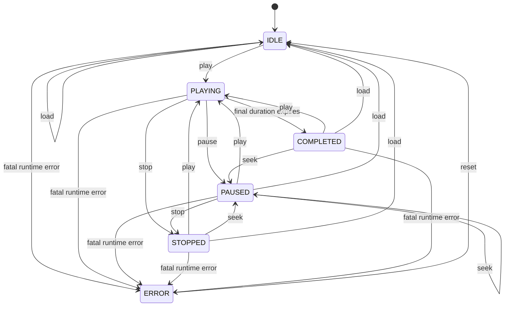

# State Machine: `@rsvp-engine/core`

```mermaid
stateDiagram-v2
    [*] --> IDLE
    IDLE --> PLAYING: play
    PLAYING --> PAUSED: pause
    PLAYING --> STOPPED: stop
    PLAYING --> COMPLETED: final duration expires
    PAUSED --> PLAYING: play
    PAUSED --> STOPPED: stop
    PAUSED --> PAUSED: seek
    STOPPED --> PLAYING: play
    STOPPED --> PAUSED: seek
    COMPLETED --> PLAYING: play
    COMPLETED --> PAUSED: seek
    PAUSED --> IDLE: load
    STOPPED --> IDLE: load
    COMPLETED --> IDLE: load
    IDLE --> IDLE: load
    IDLE --> ERROR: fatal runtime error
    PLAYING --> ERROR: fatal runtime error
    PAUSED --> ERROR: fatal runtime error
    STOPPED --> ERROR: fatal runtime error
    COMPLETED --> ERROR: fatal runtime error
    ERROR --> IDLE: reset
```

| State       | Meaning                                                     | Position                          |
| ----------- | ----------------------------------------------------------- | --------------------------------- |
| `IDLE`      | Ready but not presenting.                                   | Selected index `0`, progress `0`. |
| `PLAYING`   | Current item is visible and advancement is scheduled.       | Current visible item.             |
| `PAUSED`    | Current item remains selected; remaining time is preserved. | Unchanged.                        |
| `STOPPED`   | Playback cancelled and reset.                               | Index `0`, progress `0`.          |
| `COMPLETED` | Final item finished its display duration.                   | `length - 1`, progress `1`.       |
| `ERROR`     | Unexpected runtime failure made playback unsafe.            | Preserved until reset.            |

## Stop behavior

`stop()` is valid only from `PLAYING` or `PAUSED`. A successful call cancels the pending task, retains loaded tokens, and resets index and progress to zero without starting playback.

| Starting state | Result of `stop()`                                               | Reported error           |
| -------------- | ---------------------------------------------------------------- | ------------------------ |
| `IDLE`         | State, position, and progress are preserved.                     | `InvalidTransitionError` |
| `PLAYING`      | Enters `STOPPED` with index and progress zero.                   | None                     |
| `PAUSED`       | Enters `STOPPED` with index and progress zero.                   | None                     |
| `STOPPED`      | State, position, and progress are preserved.                     | `InvalidTransitionError` |
| `COMPLETED`    | Remains completed with the final item selected and progress one. | `InvalidTransitionError` |
| `ERROR`        | Fatal state and retained position are preserved.                 | `InvalidTransitionError` |

Stop is not idempotent: a repeated call from `STOPPED` reports an error. Empty input remains `IDLE`, where Stop is also invalid. The engine emits these errors without throwing or entering a fatal state. A destroyed engine instead throws `EngineDestroyedError`.

The React controller records invalid Stop calls in its observable `error`. Successful commands do not clear that error; consumers must call `clearError()` explicitly. Clearing the observable error does not recover a fatal `ERROR` state. Guard Stop controls using the playback state before invoking them.

## Error policy

The low-level `StateMachine.transition()` throws `InvalidTransitionError` for an illegal action. `RsvpEngine` catches invalid user controls, emits an `error` event, and preserves its state. Empty data, invalid seek indices, duplicate play, or pause in IDLE are non-fatal.

Unexpected tokenizer or scheduler failures are fatal. Explicit `load()` failures are rethrown after entering `ERROR`; constructor tokenization failures are thrown because no listener can exist yet.

`seek()` accepts only finite integers in `[0, totalItems)`. Invalid indices report `IndexOutOfBoundsError` before checking state and preserve selection, progress, and scheduling, including a paused item's remaining display time. Empty input has no valid seek index. Valid seek states remain `PAUSED`, `STOPPED`, and `COMPLETED`.

## Invariants

1. Leaving `PLAYING` cancels the pending task.
2. Pause/resume preserves the remaining display time.
3. Seek is unavailable during playback and selects an item in `PAUSED`.
4. Loading replacement data is unavailable in `PLAYING` and `ERROR`.
5. Only `reset()` exits `ERROR`, clearing loaded data and returning to `IDLE`.
