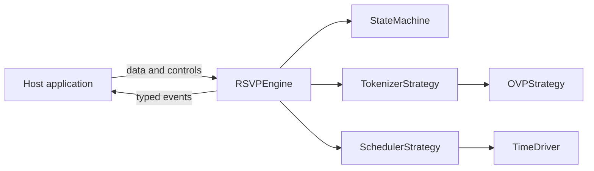

# Architecture: `@rsvp-engine/core`

Durable architectural decisions are recorded in the [ADR index](./adr/README.md).

The package is a synchronous, event-driven Rapid Serial Visual Presentation (RSVP) playback engine. Host applications own rendering, storage, visibility handling, and asynchronous data acquisition.



## Invariants

- No production dependencies.
- No DOM APIs; code must run in Node.js, workers, React Native, and browser threads.
- Minified and gzipped ESM bundle remains below 5 KB.
- TypeScript strict mode and native `#privateField` encapsulation.
- At least 95% line and branch coverage.
- Repeated 5 ms timer lag remains below 10 ms drift over a simulated minute.

## Playback model

`currentIndex` is the presented item, not the next scheduling cursor. A fresh `play()` emits index zero immediately, then schedules advancement using that item's multiplier. Pause stores the deadline delta; resume schedules exactly that remaining duration. Completion occurs only after the last item's display duration expires.

Invalid commands are reported without changing state. `ERROR` is reserved for unexpected runtime failures such as a scheduler exception. This separates caller mistakes from a broken playback session.

## Dependency injection

- `TokenizerStrategy<T>` converts synchronous input into `Token<T>[]`.
- `OVPStrategy` selects the UTF-16 viewing-position offset for string tokens.
- `SchedulerStrategy` controls delayed task execution.
- `TimeDriver` supplies the monotonic clock and timer host.

`SystemTimeDriver` uses `performance.now()` when the host provides it and falls back to `Date.now()`. Its `setTimeout` and `clearTimeout` globals are required capabilities in the default browser, worker, Node.js, and React Native hosts. Timerless embedded or worklet environments must inject a compatible `TimeDriver` instead of using the default.

Async NLP or remote tokenization stays outside the core:

```typescript
const tokens = await externalTokenizer(text);
engine.loadTokens(tokens);
```

This keeps construction, state transitions, tests, and snapshots deterministic.

## Scheduling decision

Ordinary event-loop lag is subtracted from the next delay to prevent cumulative drift. If lag is at least one entire interval, the scheduler rebases instead of scheduling immediate catch-up ticks. Readability takes precedence over catching up every missed deadline.

Browser background throttling is outside the headless core. Browser hosts should pause on visibility loss and resume when appropriate.

## Unicode decision

The default tokenizer feature-detects `Intl.Segmenter` for Unicode word boundaries. A whitespace fallback keeps older runtimes functional. `DefaultOVPStrategy` operates on grapheme clusters, with a small dependency-free fallback for combining marks and ZWJ emoji, while returning UTF-16 offsets compatible with JavaScript string slicing. A custom `OVPStrategy` can be injected into `DefaultTokenizer` without replacing the complete tokenization strategy.
